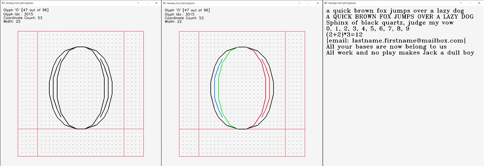

# O, Hershey Fonts!



## What and why
This is very simple, and the main goal of the project was to dip my toes in Odin. I needed something interesting enough to keep me going, but fairly simple as I'm still just exploring the language.

This repo contains a parser for the jhf format of [Hershey fonts](https://en.wikipedia.org/wiki/Hershey_fonts). The parser is used to convert this format to a simple binary format and to implement a simple tool to explore the Hershey fonts.

Hershey fonts came into my radar after reading [Daniel Holden's blog post](https://www.theorangeduck.com/page/debug-draw-text-lines) about debug text.
It turns out Mikko Mononen uses them in his excellent [Skribidi](https://github.com/memononen/Skribidi), and of course [Paul Burke](https://paulbourke.net/dataformats/hershey/) wrote about them a while back.

They seem like a really nice way to put some text onto the screen where you might only have something like `GL_LINES` available on the rendering side.

## Fonts
The `font_files` folder contains some of the jhf files as [distributed by `solsta`](https://solhsa.com/hershey/index.html). You can grab extra ones from over there, however, I've only tested the Latin fonts, your mileage might vary with the Greek / Cyrillic / Japanese. My goal here is debug text rendering, so ASCII characters will suffice!

## Programs

### Converter
As the name suggests, it converts jhf to either text form (similar to Mikko Mononen's simple simplex or Daniel Holden's consolines), or to a new and shiny Binary Hershey Font (bhf) format! The idea is that you can then `#load` these binary files into Odin, decode the binary format, and be off to the races.

The format is straightforward:
```
# INFO SECTION
glyph_count -> i32, 4 bytes
offsets -> [glyph_count] i32, 4 bytes each

# GLYPH SECTION
glyphs -> [glyph_count]
  - advance -> i16, 2 bytes
  - coords_count -> i16, 2 bytes
  - coords -> [coords_count]
    - x -> i8, 1 byte
    - y -> i8, 1 byte
```

`offsets` tells you how far to go into the file from the file start, and then each glyph is simply advance plus the `x`, `y` coords. The coordinates are expressed in such a way that the point at the left edge and baseline of the glyph is `(0, 0)`. This choice makes writing the function to lay out the glyphs to the screen trivial.

### Explorer
Explorer is a simple program to view how glyphs in each .jhf file look.

There are two modes - the glyph exploration and font preview.
To switch between them you can press `F1`.
- In glyph exploration you can use `→`/`k` and `←`/`j` to move between glyphs. Additionally, you can press `c` to visualize the separate segments within a glyph with different colors.

- In font preview you can use `=` to increase font size and `-` to decrease it.

## Disclaimer
After [The Hershey Fonts by sol_HSA](https://solhsa.com/hershey/index.html)
```
USE RESTRICTION:
  This distribution of the Hershey Fonts may be used by anyone for
  any purpose, commercial or otherwise, providing that:
    1. The following acknowledgments must be distributed with
      the font data:
      - The Hershey Fonts were originally created by Dr.
        A. V. Hershey while working at the U. S.
        National Bureau of Standards.
      - The format of the Font data in this distribution
        was originally created by
          James Hurt
          Cognition, Inc.
          900 Technology Park Drive
          Billerica, MA 01821
          (mit-eddie!ci-dandelion!hurt)
    2. The font data in this distribution may be converted into
      any other format *EXCEPT* the format distributed by
      the U.S. NTIS (which organization holds the rights
      to the distribution and use of the font data in that
      particular format). Not that anybody would really
      *want* to use their format... each point is described
      in eight bytes as "xxx yyy:", where xxx and yyy are
      the coordinate values as ASCII numbers.

*PLEASE* be reassured: The legal implications of NTIS' attempt to control
a particular form of the Hershey Fonts *are* troubling. HOWEVER: We have
been endlessly and repeatedly assured by NTIS that they do not care what
we do with our version of the font data, they do not want to know about it,
they understand that we are distributing this information all over the world,
etc etc etc... but because it isn't in their *exact* distribution format, they
just don't care!!! So go ahead and use the data with a clear conscience! (If
you feel bad about it, take a smaller deduction for something on your taxes
next week...)

The Hershey Fonts:
  - are a set of more than 2000 glyph (symbol) descriptions in vector
    ( <x,y> point-to-point ) format
  - can be grouped as almost 20 'occidental' (English, Greek,
    Cyrillic) fonts, 3 or more 'oriental' (Kanji, Hiragana,
    and Katakana) fonts, and a few hundred miscellaneous
    symbols (mathematical, musical, cartographic, etc etc)
  - are suitable for typographic quality output on a vector device
    (such as a plotter) when used at an appropriate scale.
  - were digitized by Dr. A. V. Hershey while working for the U.S.
    Government National Bureau of Standards (NBS).
  - are in the public domain, with a few caveats:
    - They are available from NTIS (National Technical Info.
      Service) in a computer-readable form which is *not*
      in the public domain. This format is described in
      a hardcopy publication "Tables of Coordinates for
      Hershey's Repertory of Occidental Type Fonts and
      Graphic Symbols" available from NTIS for less than
      $20 US (phone number +1 703 487 4763).
    - NTIS does not care about and doesn't want to know about
      what happens to Hershey Font data that is not
      distributed in their exact format.
    - This distribution is not in the NTIS format, and thus is
      only subject to the simple restriction described
      at the top of this file.

Hard Copy samples of the Hershey Fonts are best obtained by purchasing the
book described above from NTIS. It contains a sample of all of the Occidental
symbols (but none of the Oriental symbols).
```
